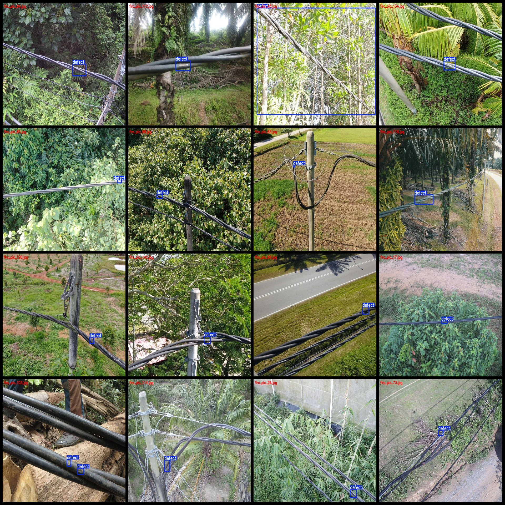
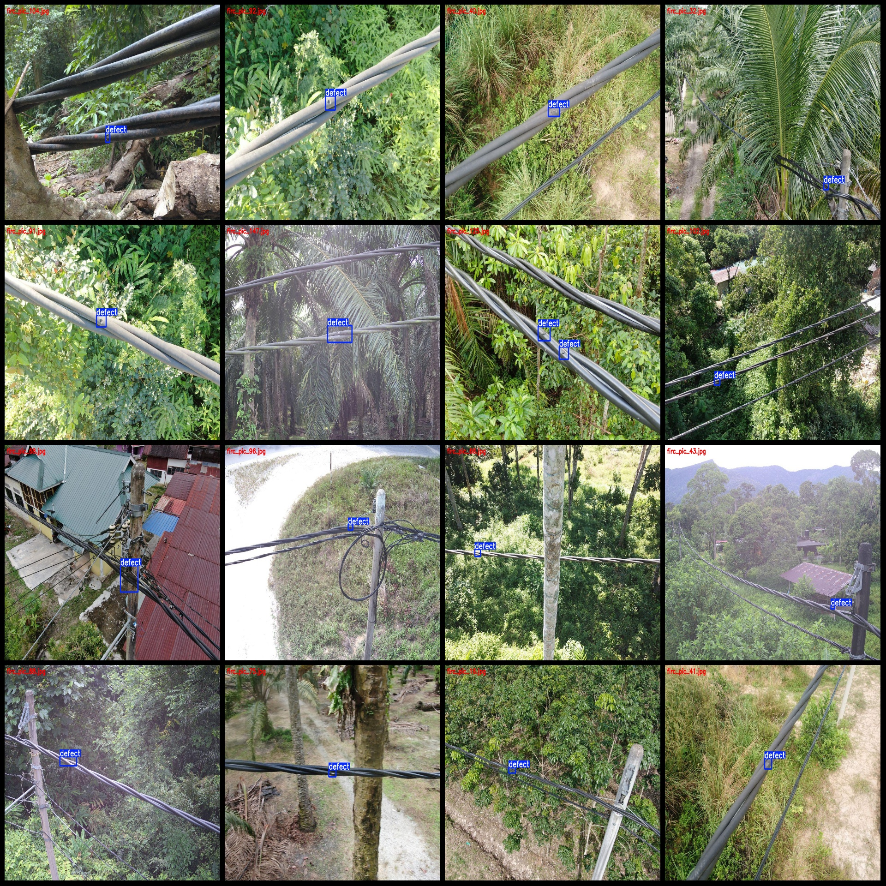

# High-resolution image dataset for power scene and cable defect detection in VOC+YOLO format with 150 images per category

The dataset format is Pascal VOC format+YOLO format. It does not include the split paths and only contains jpg images along with corresponding VOC format xml files and yolo format txt files.
number of images: 150  
annotation count: 150  
The number of txt files is 150.
annotationnumber of classes: 1  
"defect"
boxes per class:   
defect box count = 173  
total boxes: 173  
images per class:   
defect images = 150  
The image resolution is 1024x768.
Use the annotation tool: labelImg.
Annotation rules: draw a rectangle around the class.
Important notes: The dataset must be divided into training, validation, and test sets.
Special Notice: This dataset does not guarantee the accuracy of trained models or weight files.
Image preview:
## Images

Here is a pay link on Stripe ( https://buy.stripe.com/3cs8yP7sY87d0vu9AB ). Please contact me lonlonago@foxmail.com after funding $89, and I will send you a complete data files , thank you!

